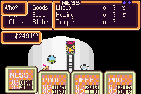
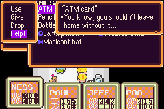
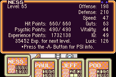
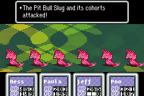

| Branch | Status |
| --- | --- |
| Project |  |
| `master` |  |

# MOTHER 2 Translation for the GBA
This is a work-in-progress translation patch for MOTHER 2 on the GBA.

## Discord
Our Discord server is pretty active: https://discord.gg/ADXS5Ub

## Hasn't it been done?
There are at least two other projects that translate the MOTHER 2 side of the game:
- Mato's menu text translation: [here](http://mother12.earthboundcentral.com/)
- TheZunar123's full translation (in progress): [here](http://earthboundcentral.com/forum/viewtopic.php?f=3&t=526) and [here](http://forum.starmen.net/forum/Games/Mother2/Mother-2-Fan-Translation/page/1/)

## Why start another project?
Neither of the above projects use a true variable-width-font (VWF) to render text. A VWF would look much better and would make the game more enjoyable.

Adding a VWF is hard, however. Mato explains [here](http://earthboundcentral.com/2011/04/a-look-at-the-mother-2-side/) why it's generally a very difficult task to fully translate the game, let alone to insert a VWF.

A long time ago (before the release of the [MOTHER 3 Fan Translation](http://mother3.fobby.net)), I started working on a proof-of-concept VWF for MOTHER 2 on the GBA. It worked, but it quickly became apparent that the amount of hacking required would be huge; window-rendering functions contain a ton of repeated code and some of it is downright non-sensical.

A few years after that, I tried it again from scratch with the intent of having a more organized codebase. It went much better, but I was soon limited by not having any translated dialogue, rather than not having a VWF; I couldn't test much of my VWF code without any English text inserted into the ROM.

## Now what?
This project aims to both complete the VWF codebase and to provide a tool for translating the game's dialogue. My new intent is to bring the hack to a state where I can just sit down and translate text efficiently in my spare time with a graphical tool. Not only that, but having such a tool means that other people can contribute!

## Screenshots
     

# Building

## Dependencies
- [.NET Core 2.1 or later](https://dotnet.microsoft.com/download)
- [PowerShell Core 6.0 or later](https://docs.microsoft.com/en-us/powershell/scripting/install/installing-powershell?view=powershell-6)
- [GNU Arm Embedded Toolchain](https://developer.arm.com/open-source/gnu-toolchain/gnu-rm/downloads)
- [armips](https://github.com/Kingcom/armips)
- Unmodified MOTHER 1+2 ROM (SHA-1 `F27336B9...`)
- Unmodified, unheadered EarthBound ROM (SHA-1 `D67A8EF3...`)
- (Optional) For building the GUI script tool: [.NET Core 3.0 or later](https://dotnet.microsoft.com/download/dotnet-core/3.0)

1. One-time setup
    1. Install .NET Core 2.1, PowerShell Core, and GNU Arm Embedded Toolchain. Make sure the Arm toolchain's `bin` folder is in your `PATH`.
    2. Create a `bin` folder in the root of the repo.
    3. Copy MOTHER 1+2 ROM to `bin/m12fresh.gba`.
    4. Copy EarthBound ROM to `bin/eb.smc`.
    5. Run `build-tools.ps1`.
        - Windows: `.\build-tools.ps1` in a PowerShell prompt
        - Linux: `pwsh build-tools.ps1`
    6. Copy/build `armips` to `bin`.
        - Windows: grab the latest release [here](https://github.com/Kingcom/armips/releases) and copy the executable to `bin/armips.exe`.
        - Linux: follow the [README](https://github.com/Kingcom/armips/blob/master/Readme.md) to build `armips` and copy the executable to `bin/armips`.
2. Building the ROM
    1. Run `build.ps1`.
    2. The default compiled ROM is copied to `bin/m12.gba`.
3. (Optional) Build the GUI script tool:
    1. `dotnet build tools/ScriptTool` (don't set the output directory)
    2. `dotnet build tools/ScriptToolGui -o bin/ScriptToolGui`
    3. Run with `dotnet bin/ScriptToolGui/ScriptToolGui.dll` (or just run the EXE file directly).
