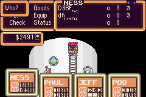
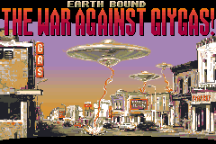
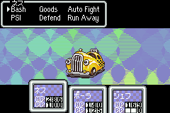
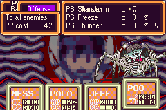
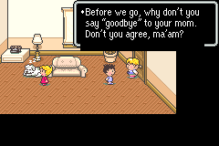
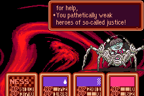

### MOTHER 2 Translation for the GBA
This is a work-in-progress translation patch for MOTHER 2 on the GBA.

### Hasn't it been done?
There are at least two other projects that translate the MOTHER 2 side of the game:
- Mato's menu text translation: [here](http://mother12.earthboundcentral.com/)
- TheZunar123's full translation (in progress): [here](http://earthboundcentral.com/forum/viewtopic.php?f=3&t=526) and [here](http://forum.starmen.net/forum/Games/Mother2/Mother-2-Fan-Translation/page/1/)

### Why start another project?
Neither of the above projects use a true variable-width-font (VWF) to render text. A VWF would look much better and would make the game more enjoyable.

Adding a VWF is hard, however. Mato explains [here](http://earthboundcentral.com/2011/04/a-look-at-the-mother-2-side/) why it's generally a very difficult task to fully translate the game, let alone to insert a VWF.

A long time ago (before the release of the [MOTHER 3 Fan Translation](http://mother3.fobby.net)), I started working on a proof-of-concept VWF for MOTHER 2 on the GBA. It worked, but it quickly became apparent that the amount of hacking required would be huge; window-rendering functions contain a ton of repeated code and some of it is downright non-sensical.

A few years after that, I tried it again from scratch with the intent of having a more organized codebase. It went much better, but I was soon limited by not having any translated dialogue, rather than not having a VWF; I couldn't test much of my VWF code without any English text inserted into the ROM.

### Now what?
This project aims to both complete the VWF codebase and to provide a tool for translating the game's dialogue. My new intent is to bring the hack to a state where I can just sit down and translate text efficiently in my spare time with a graphical tool. Not only that, but having such a tool means that other people can contribute!

### Status
The core of the VWF is complete. But it needs to be implemented in dozens of different places in the game's code. I've finished many of them, but there are probably still many more. Pretty much all of the game's text still needs to be translated too.

Some screenshots:

  

  

### Dependencies
If you want to just use the graphical tool to help with the translation, you just need .NET 4.5.1. If you want to actually compile the hack code and test it out, you will need [armips](https://github.com/Kingcom/armips). The Hack is somewhat stable, but there are a few major issues we need to fix, such as calling your dad crashes the game.
